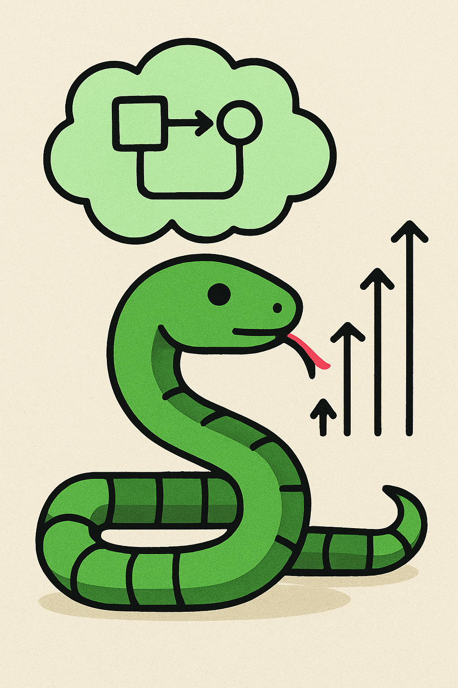

<table>
  <tr>
    <td valign="top">
      
    </td>
    <td valign="top">
      <h1>🐍 Reinforcement Learning Snake Project</h1>
      <p>Welcome to the RL Snake project! This guide will walk you through setting up the development environment so you can start coding.</p>
    </td>
  </tr>
</table>

---

## 🚀 Getting Started: Environment Setup

We use `conda` to manage our project's environment and dependencies. This ensures everyone has the exact same setup and avoids "it works on my machine" issues.

### 1. Create the Conda Environment 🛠️

Navigate to the project's root directory (where the `environment.yml` file is located) in your terminal and run the following command:

```bash
conda env create -f environment.yml
```

This command will read the `environment.yml` file and install all the necessary packages (like PyTorch, Pygame, etc.) into a new environment named `rl_snake_env`.

### 2. Activate the Environment ✅

Once the environment is created, you need to activate it every time you work on the project. Run this command:

```bash
conda activate rl_snake_env
```

Your terminal prompt should now show `(rl_snake_env)` at the beginning, indicating that the environment is active.

---

## 💻 Current Progress

We have successfully implemented the core game environment! Here's a quick summary of what's done:

*   **Game Environment (`snake_game.py`)** 🕹️: The main `SnakeGame` class is built using Pygame. It handles the game window, drawing, and core logic.
*   **Snake & Food Mechanics** 🍎: The snake can move, eat food, and grow longer. Food spawns at random locations.
*   **RL-Ready API** 🤖: The environment exposes `step(action)` and `reset()` methods, making it ready for an RL agent to interact with. It returns `(reward, done, score)`.
*   **Collision Detection** 💥: The game correctly detects collisions with walls and the snake's own body, ending the episode.
*   **Manual Testing Mode** 👨‍💻: You can run `snake_game.py` directly to play the game with your keyboard, which is great for testing!

---